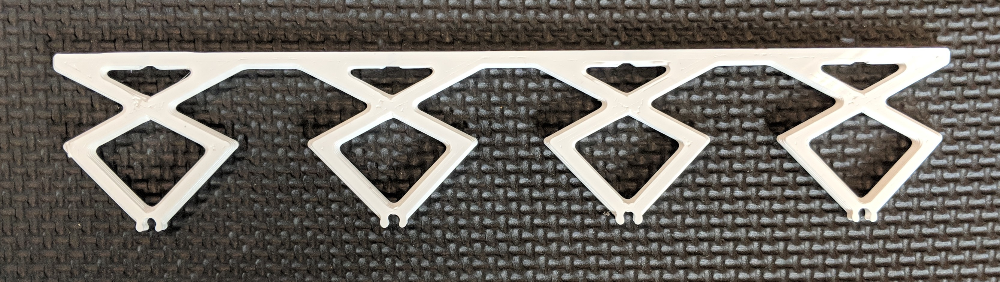
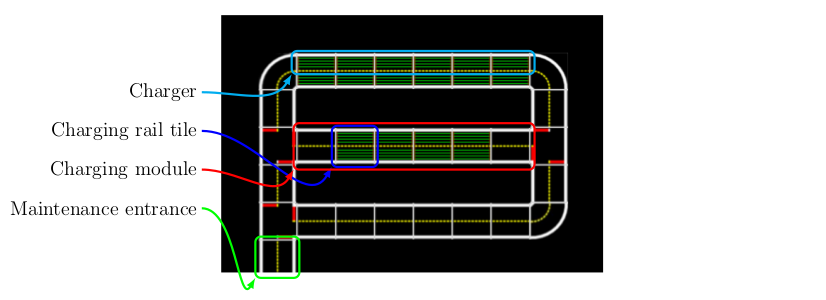

# Definitions {#autocharging-definitions status=beta}

Requires: put requirements here

Results: put result here

Next Steps: put next steps here

## Maintenance area

The city area and the charging/calibration area of the Autolab are strictly separated by a single road tile. Every tile whose purpose is the servicing of Autobots is part of the maintenance area. This includes every intersection and road which guides the Autobot from the maintenance entrance to a charging module and back.

## Charging area

A charging area is the combination of multiple charging modules () and intersections, straight and curved tiles which connect the charging modules to the maintenance area entrance.  shows a charging area.

Inside a charging area, Autobots drive in a charger () and charge their battery by making contact between the attached current collector () and the above mounted charging rails ().

## Current collector {#autocharging-definitions-currcol}

The current collector  is a flexible shaft mounted on top of an Autobot. Its purpose is to make contact with the charging rails.

<figcaption>
An Autobot with a current collector.
</figcaption>

## Charging rail {#autocharging-definitions-chargingrail}

A charging rail is a brass tube mounted over tiles of a charging module () with the help of high voltage poles ().

<figcaption>
A brasstube.
</figcaption>

## High voltage pole {#autocharging-definitions-hvp}

The purpose of the high voltage pole is to mount the charging rails over the street.

<figcaption>
A high voltage pole.
</figcaption>

## Insulator {#autocharging-definitions-insulator}

The insulator connects the charging rails to the high voltage pole structure.

<figcaption>
An insulator.
</figcaption>

## Charging rail tiles {#autocharging-definitions-railtiles}

Charging rail tiles are tiles with charging rails. Autobots can charge in both directions. Each charging rail tile has $8$ brass rails. See .

## Charging module {#autocharging-definitions-module}

A charging module describes the combination of a charging rail and all connected straight and curved tiles up to the next intersection. See .

## Charger {#autocharging-definitions-charger}

A charger describes one single lane of a charging module. See .

<figcaption>
Figure showing naming Conventions
</figcaption>

