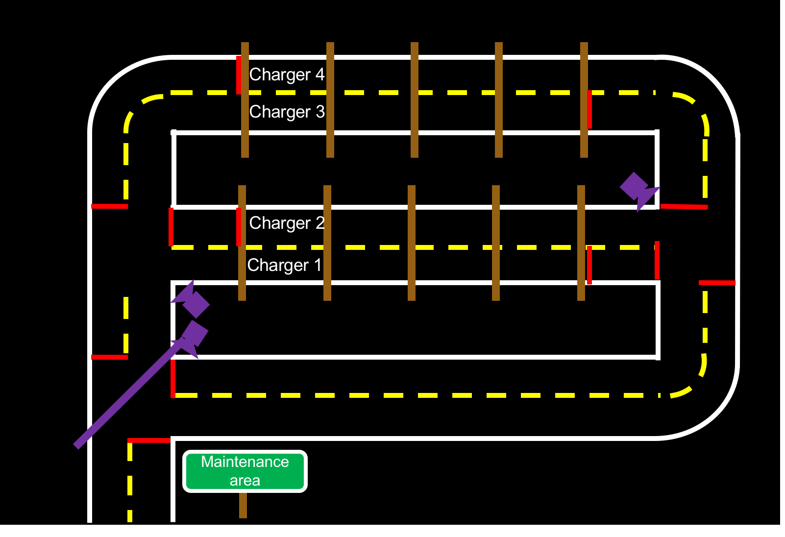

# Infrastructure of Maintenance Area {#autocharging-maintenance-area-description status=ready}

This part contains the steps to plan and build a maintenance area.  
Before starting, here is a general schematic view of a maintenance area for module 1 and module 2.

<figure class="flow-subfigures">  
    <figure>
        <figcaption>Module 1</figcaption>
        
    </figure>
    <figure>  
        <figcaption>Module 2</figcaption>
        
    </figure>
</figure>
