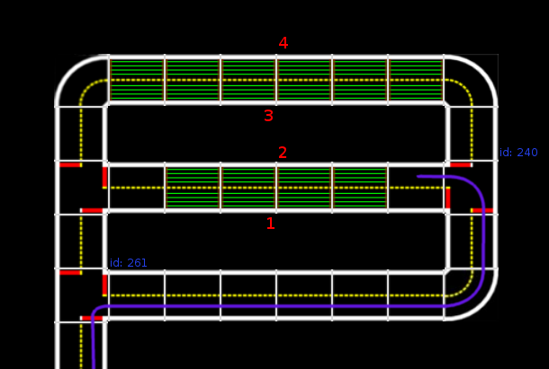

# Software setup on the Duckiebot {#autocharging-map status=ready}

## Goal

In order to allow the duckiebot to have the autocharging capability. The duckiebot requires to run a container which does the following tasks.

1) The duckiebot has to be guided from any place on the map to the charging area.<br />
2) At the charging area, it understands the instructions of the autocharging<br /> manager, which directs it to the appropriate charging lane.<br />
3) From the autocharging entrance the duckiebot follows the correct path to the charging lane<br />
4) In the charging lane it successfully charges.<br />
5) After charging the duckiebot navigates back to the city.<br />

All these tasks are bundled in the megacity image. However, prior to running it, the appropriate paths of the autocharging area have to be setup.

## Setting up container

Clone the following repository

    git clone https://github.com/duckietown/rpi-autocharging-demo.git
    cd rpi-autocharging-demo.git

open with an text editor the default.yaml file. The default.yaml file should have the following outline and structure:

```
# Maintenance gate
maintenance_entrance: {'62': 1, '143': 0}
maintenance_path: {'157': 1, '66': 0,'136': 2, '58': 1, '63': 0, '68': 2,'62': 1, '143': 0}
maintenance_exit: {'135': [1,2]}
maintenance_intersection: {'tag': 261}


# General path back to city
path_to_city: {'238': 1, '144':2, '260': 2, '149': 0, '153': 1, '237': 1, '236': 0, '242': 0, '61': 1}

# Charging station
charging_stations:
  stop_signs: {'tag': [190, 193, 37, 194]}
  station1:
    path_in: {'261': 1, '235': 2, '240': 1}
    path_calib: {'144': 2, '260': 1}
  station2:
    path_in: {'261': 2, '240': 0, '235': 1}
    path_calib: {'236': 0, '153': 0, '243': 2}
  station3:
    path_in: {'261': 1, '235': 1, '240': 1}
    path_calib: {'238': 1, '260': 1}
  station4:
    path_in: {'261': 2, '240': 1, '235': 1}
    path_calib: {'237': 1, '153': 0, '243': 2}
  entrances: {'235': [1,2], '240': [0,1]}
  exits: {'144': [0,2], 236': [0,2], '238': [1,2], '237': [0,1]}

# Calibration station
calibration_station:
  entrances: {'243': 2, '260': 1}
exits: {'242': [0,1]}
```

The parameters in the yaml file correspond to the following map:

picture of map

The parameters in the config file are dictionaries - each key (i.e. '150') stands for an april tag ID and maps to either a single direction (i.e. 1) or to multiple directions, stored in a list (i.e. [0,1,2]). The directions, stored as integers, map as follows:

[0, 1, 2] == [LEFT, STRAIGHT, RIGHT].

## Add your own paths

### path_in

The "path_in" parameter of a charger should map traffic sign april tag IDs to a single turn type, which in sum guide the Duckiebot to the charger. In [](#fig:path_to_charger2) an example is given. The path_in of charger 2 would then be

    path_in: {'261': 2, '240': 0}


<div figure-id="fig:path_to_charger2">

<figcaption>
    
An example path from maintenance entrance to charger 2.
</figcaption>
</div>

### path_to_city

The dictionary "path_to_city" guides a Duckiebot from every possible leaving position (i.e. charger exit, calibration exit) back to the city. In [](#fig:path_to_city), all paths are plotted for an example maintenance area (without a calibration area).

<div figure-id="fig:path_to_city">

<figcaption>
All possible exit paths from an example maintenance area (without calibration area).
</figcaption>
</div>

### charging_stations: entrances, exits

The dictionary "entrances" and "exits" in the charging_stations parameter contains every entrance / exit to charging stations. This information is needed in the code to determine when a Duckiebot enters or leaves a charger.

### maintenance_entrance / maintenance_exit

This dictionaries define which april tag IDs correspond to the entrance / exit of the maintenance area. This information is needed to detect when a Duckiebot enters or leaves the maintenance area.

After setting up all parameters our docker image is ready to be build

## Push to your Docker account

we are building the docker file for your own charging area:

    laptop $ docker build --rm -f "Dockerfile" -t /[your docker repository]/megacity:latest

[your docker repository] is the docker hub repository where the image will be saved, from which the image can be pulled to the duckiebot. example for generic autocharging area:

    laptop $ docker build --rm -f "Dockerfile" -t /duckietown/megacity:latest

now we need to push to the remote repository on dockerhub

    laptop $ docker push [your docker repository]/megacity:latest
