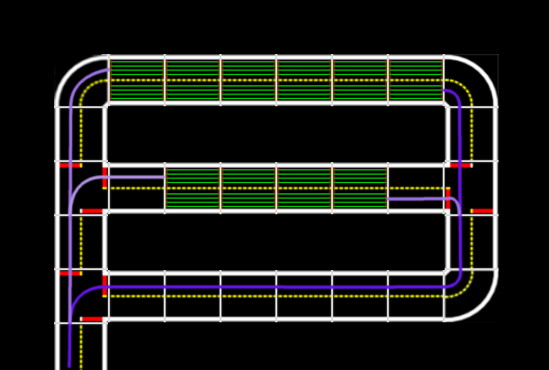

# SOFTWARE : Create the map {#autocharging-map status=beta}

Requires: put requirements here

Results: put result here

Next Steps: put next steps here

## Preparation

The branch used for Autolabs is called megacity.

Checkout the branch megacity and build the catkin workspace

    git checkout megacity
    git pull
    ./dependencies_for_duckiebot.sh
    ./dependencies_common.sh
    source environment.sh
    make build-catkin

Go to the configuration file folder for the maintenance node

    cd catkin_ws/src/00-infrastructure/duckietown/config/baseline
    /maintenance_control/maintenance_control_node

and copy the default.yaml file for your city

    cp default.yaml <your_city_name>.yaml

Edit the newly created file.

The parameters in the config file are dictionaries - each key (i.e. '150') stands for an april tag ID and maps to either a single direction (i.e. 1) or to multiple directions, stored in a list (i.e. [0,1,2]). The directions, stored as integers, map as follows:

[0, 1, 2] == [LEFT, STRAIGHT, RIGHT].

## Add your own paths

### path_in

The "path_in" parameter of a charger should map traffic sign april tag IDs to a single turn type, which in sum guide the Duckiebot to the charger. In  an example is given. The path_in of charger 2 would then be

    path_in: {'261': 2, '240': 0}

<figcaption>
An example path from maintenance entrance to charger 2.
</figcaption>

### path_calib

In the case that a calibration area is used, the dictionary "path_calib" guides the Duckiebot from a charger exit to the calibration area. In  an example is given. The path_calib of charger 2 would then be

    path_calib: {'236': 0, '153': 0, '243': 2}

<figcaption>
An example path from charger 2 to calibration area.
</figcaption>

### path_to_city

The dictionary "path_to_city" guides a Duckiebot from every possible leaving position (i.e. charger exit, calibration exit) back to the city. In , all paths are plotted for an example maintenance area (without a calibration area).

<figcaption>
All possible exit paths from an example maintenance area (without calibration area).
</figcaption>

### charging_stations: entrances, exits

The dictionary "entrances" and "exits" in the charging_stations parameter contains every entrance / exit to charging stations. This information is needed in the code to determine when a Duckiebot enters or leaves a charger.

### maintenance_entrance / maintenance_exit

This dictionaries define which april tag IDs correspond to the entrance / exit of the maintenance area. This information is needed to detect when a Duckiebot enters or leaves the maintenance area.

### calibration_station: entrances, exits

If a calibration area is used, these parameters define the entrance / exit of it.
