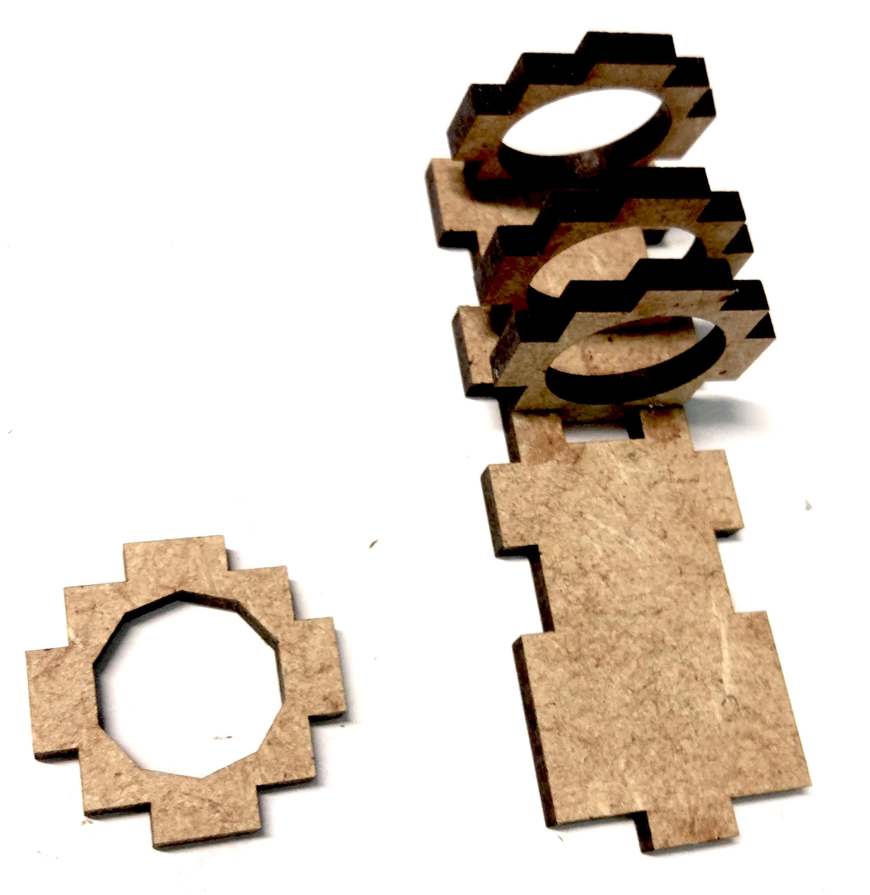
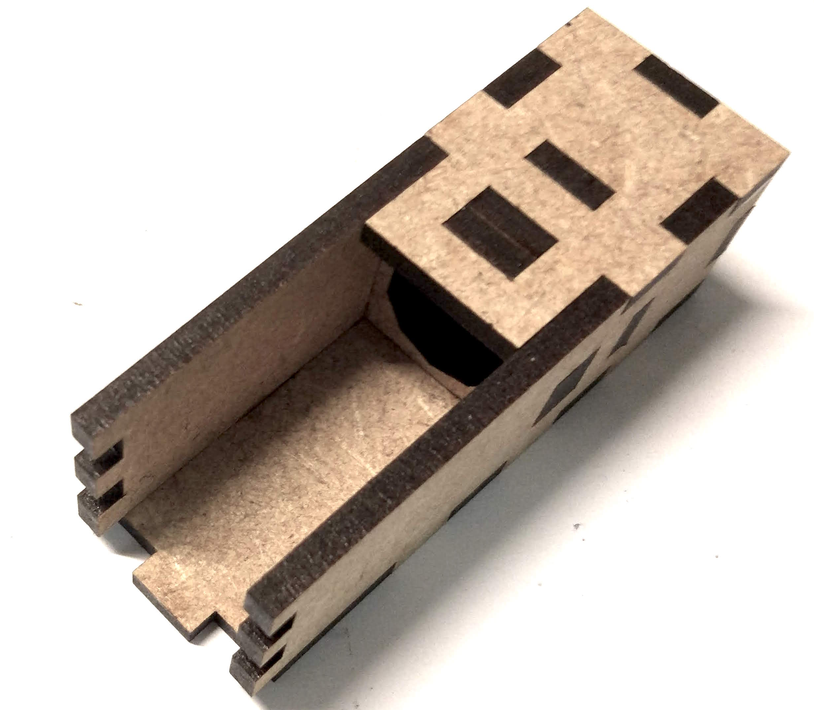
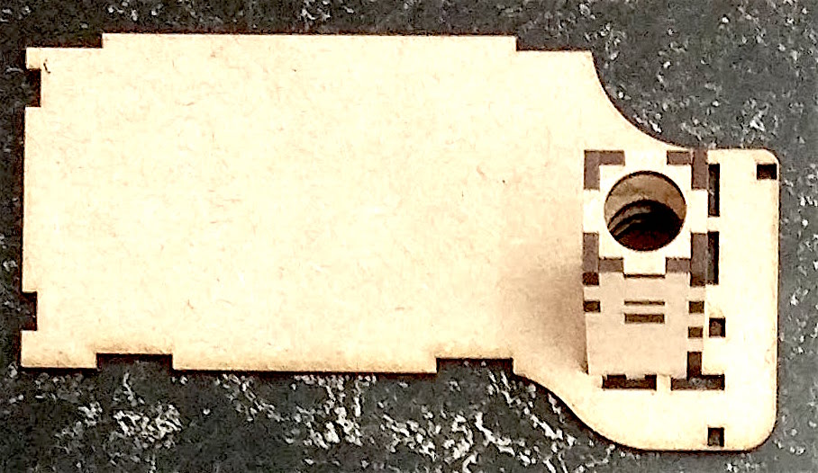
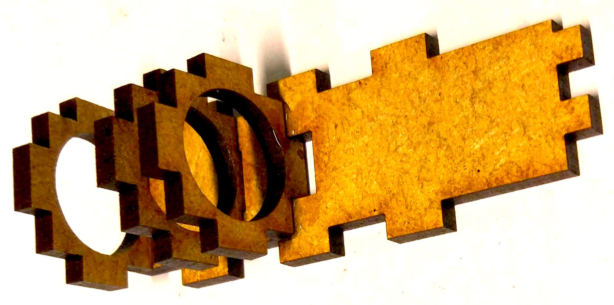
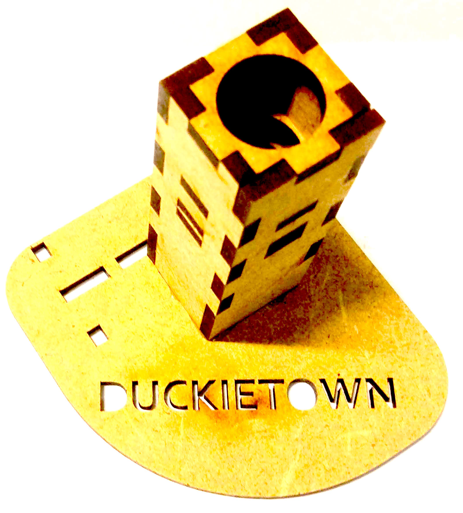
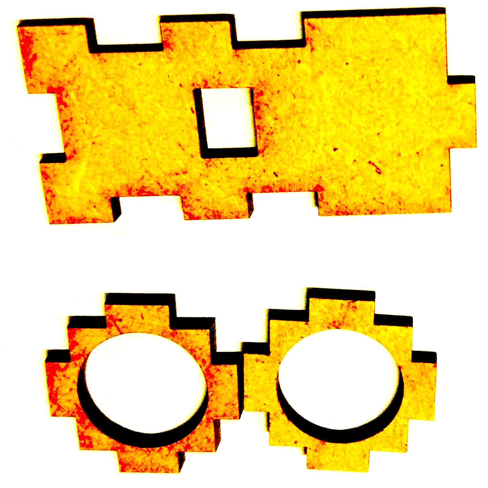
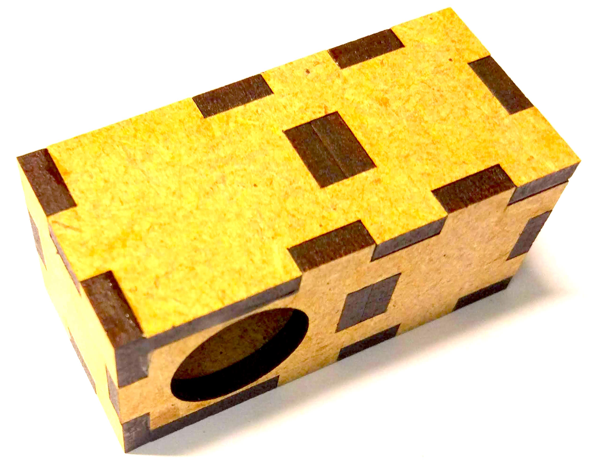

# Traffic Light Parts Assembly {#components_assembly status=beta}

This section describes the assembly of the components of a traffic light.

Requires: Laser cut traffic light parts []  

Requires: Strong wood glue []  

Result: Traffic light parts []  

Next: Traffic light assembly .  

## Tube holder with big ground plate  

<figcaption>
</figcaption>

  

<figcaption>
</figcaption>

  

<figcaption>
</figcaption>

  

<figcaption>
</figcaption>

  

<figcaption>
</figcaption>

  

<figcaption>
</figcaption>

    

<figcaption>
</figcaption>

  

<figcaption>
</figcaption>

  

## Tube holder with small ground plate

<figcaption>
</figcaption>

  

<figcaption>
</figcaption>

  

<figcaption>
</figcaption>

  

<figcaption>
</figcaption>

  

<figcaption>
</figcaption>

  

<figcaption>
</figcaption>

  

<figcaption>
</figcaption>

  

## Traffic light LED housing

<figcaption>
</figcaption>

  

<figcaption>
</figcaption>

  

<figcaption>
</figcaption>

  

<figcaption>
</figcaption>

  

<figcaption>
</figcaption>

  

<figcaption>
</figcaption>

  

## Ground module cover

<figcaption>
</figcaption>

  

<figcaption>
</figcaption>

  

## Joint module

<figcaption>
</figcaption>

  

<figcaption>
</figcaption>

  

<figcaption>
</figcaption>

  

<figcaption>
</figcaption>

  

<figcaption>
</figcaption>

  

<figcaption>
</figcaption>

  

<figcaption>
</figcaption>

  

<figcaption>
</figcaption>

  
