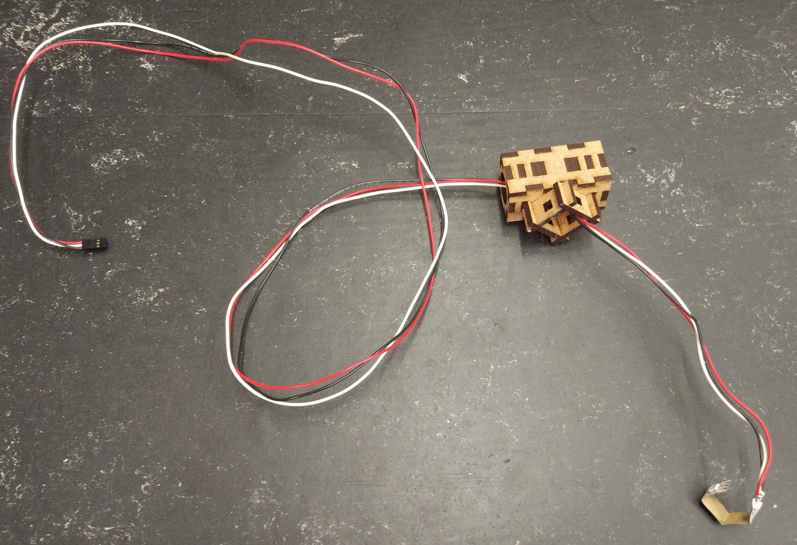
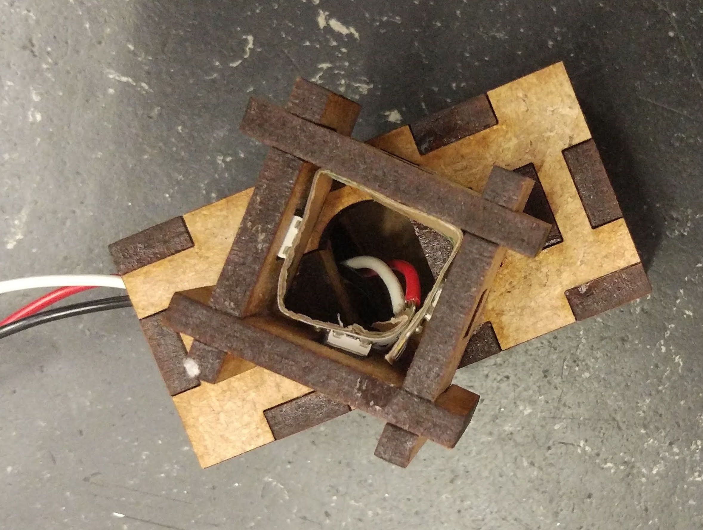
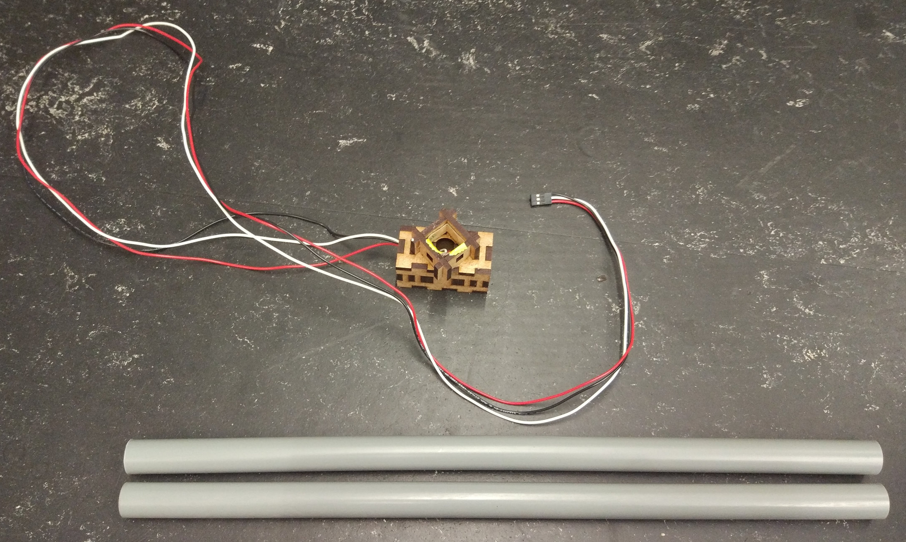
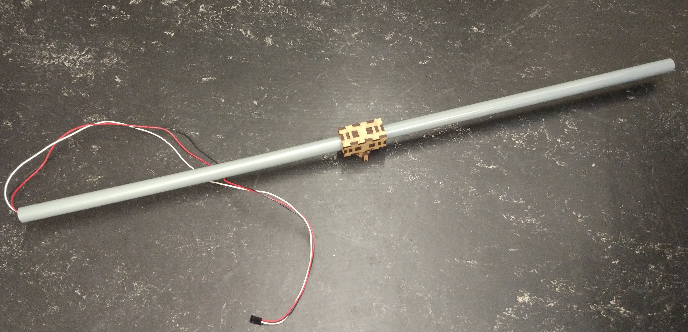
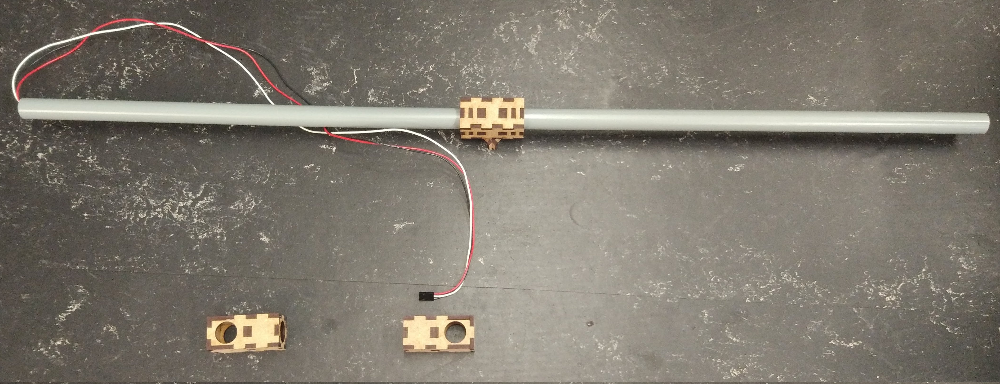
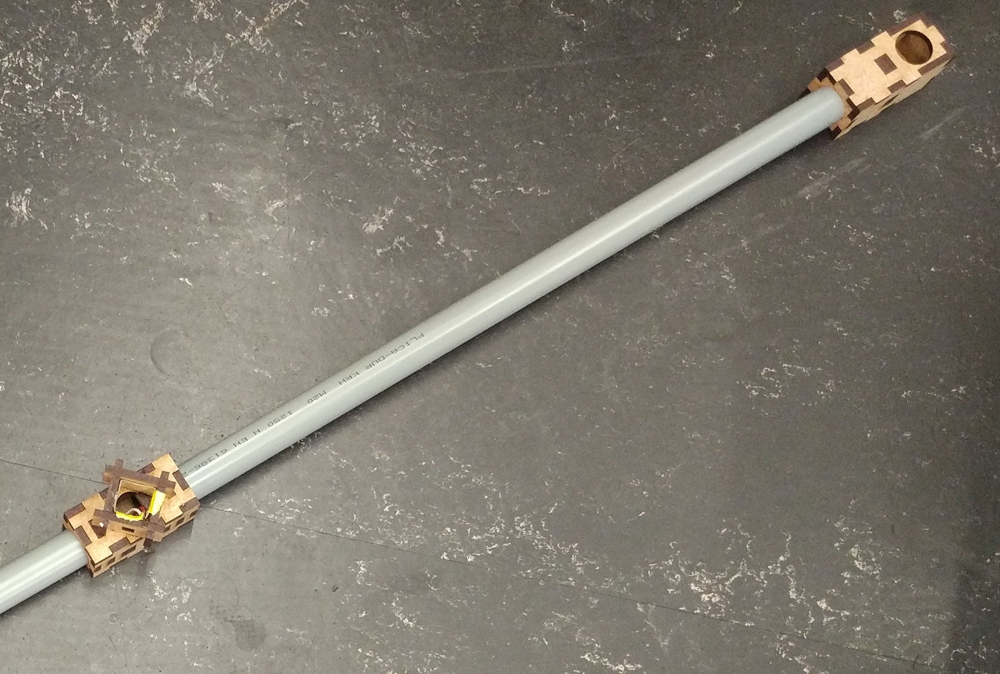
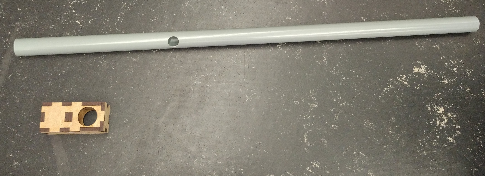
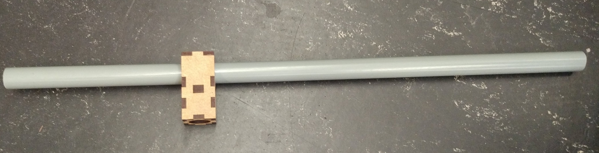
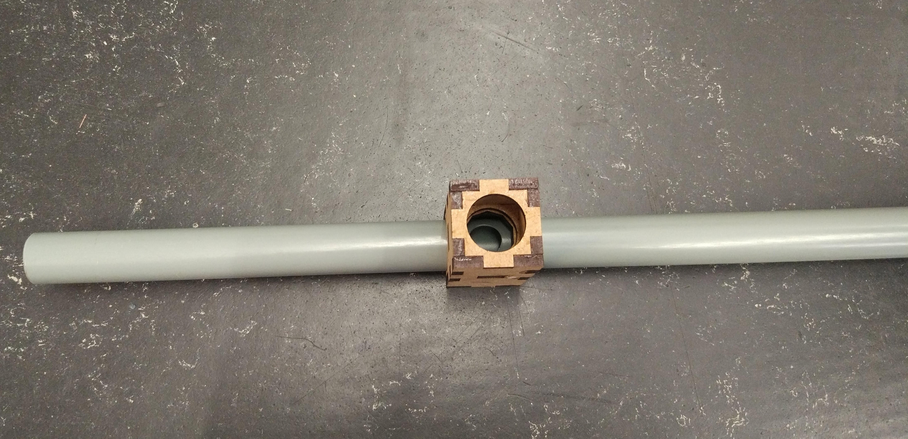
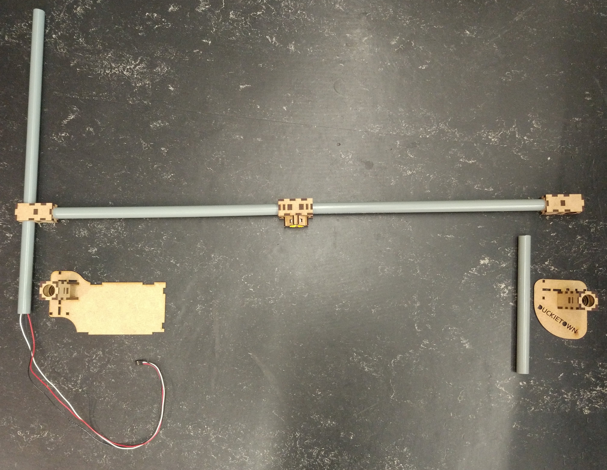

# Traffic Light Assembly {#traffic-light-assembly status=beta}

This section describes the assembly of a traffic light.

Requires: Assembled traffic light components   

Requires: Some tape and wood glue []  

Result: A traffic light .  

Next: Installation of the traffic light in the town .

## Components of the traffic light {#tl-mat}

<figcaption>
Parts of a traffic light.
</figcaption>

These components are needed for one traffic light:

* Tube holder with big ground plate
* Tube holder with small ground plate (Duckietown)
* Cable with soldered LED stripe
* 2 Joint modules
* Traffic light LED housing
* Raspberry Pi base plate
* Ground module cover (Duckietown)
* Camera mount
* Camera mount cover
* Short tube
* 2 Medium tubes
* Long tube with hole at the side
* Raspberry Pi
* Raspberry Pi shield
* SD card with Duckietown software
* USB cable
* Ethernet cable
* 4 Traffic sign stands
* 4 Traffic sign stand supports

To fix things the following is needed:

* Tape
* Wood glue or a hot glue gun

## Assembling the Traffic Light

### Put the LEDs into the housing

<figcaption>
Cable with soldered LED stripe LED housing
</figcaption>

  

<figcaption>
</figcaption>

  
Carefully push the LEDs into the designated holes.

<figcaption>
</figcaption>

  

<figcaption>
</figcaption>

  
Fix the LEDs with some tape, don't use glue.

<figcaption>
</figcaption>

### Connect the tubes

<figcaption>
Medium tubes and LED housing.
</figcaption>

  
Stick the tubes into the sides of the LED housing and pull the cable through one side.

<figcaption>
</figcaption>

  
Add the joint modules on the side of the tube without the cable.  

<figcaption>
</figcaption>

  

<figcaption>
</figcaption>

    
Mount the other joint module on the long tube, such that it aligns with the hole.  

<figcaption>
</figcaption>

  

<figcaption>
</figcaption>

  

<figcaption>
</figcaption>

  
Pull the cable through longer tube and stick the tube into the joint module.

<figcaption>
</figcaption>

  

<figcaption>
</figcaption>

  
Put the tubes into the tube holders.  

<figcaption>
</figcaption>

  

<figcaption>
</figcaption>

### Connect the Raspberry Pi

<figcaption>
</figcaption>

  
Plug the shield on top of the Raspberry Pi.  
Insert the SD card.  
Connect the LED cable to the shield.  
Connect the Ethernet cable.  
Connect the USB cable.

<figcaption>
</figcaption>

  
If done correctly the LEDs should be on.  

<figcaption>
</figcaption>

  
Close the ground module with the case.    

<figcaption>
</figcaption>

<figcaption>
</figcaption>

### Add traffic sign stands

<figcaption>
</figcaption>

  

<figcaption>
</figcaption>

  

### Fully assembled traffic light

<figcaption>
Fully assembled traffic light.
</figcaption>

