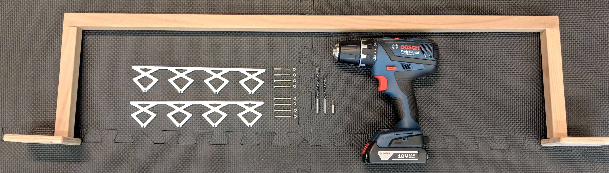
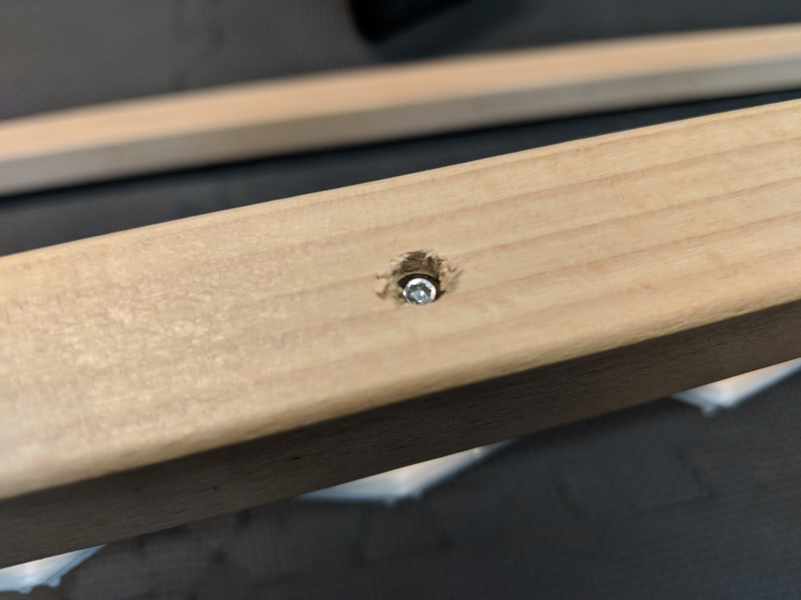

# Charging module {#autocharging-charging-module status=draft}

For the construction of a charging module, you have many degrees of freedom. This includes the choice of material of the wooden structure (may be metal as well), the type of connection between the structure elements (screws, glue, nails), the length of the cables and many more.

In the following, you find the description on how we did it in Zurich.

## Material for one charging module

In this list, $X$ will denote the number of charging rail tiles in a charging module. \emph{Reminder}: One charging rail tile can fit $3$ Duckiebots ($1.5$ per lane).

* $8 \times$ brass rod $Ø4mm$, length ($10cm + X \times 59cm$)
* $(X + 1)$ $\times$ wooden structure top piece ($2 \times 2 \times 90cm$)
* $(2 \times (X + 1))$ $\times$ wooden structure side piece ($2 \times 2 \times 20cm$)
* $(2 \times (X + 1))$ $\times$ wooden structure floor piece ($10 \times 10 \times 1cm$)
* $(4 \times (X + 1))$ Woodscrew for high voltage pole, i.e. screw $Ø3.2 \times 40mm$
* $(8 \times (X + 1))$ screw $M3 \times 30mm$ and $M3$ nuts
* $(2 \times (X + 1))$ $\times$ insulator - [self-print here](https://www.thingiverse.com/thing:2996297/files) or [order here](https://www.shapeways.com/product/QN3HP9EAH/megacity-insulator)
* Drill $Ø4mm$ and $Ø6mm$
* $\lceil {\frac {X}{4}}\rceil \times $ power supply which enables you to drive 5V and 30Amps
* $Ø4mm \times 6m$ red cable
* $Ø4mm \times 6m$ black cable
* $8 \times$ [laboratory plug CAT I Ø4mm](https://www.distrelec.ch/en/p/14048007)

## Building a charging module

### Assemble the wooden structure

Assemble the wooden structure as in . This part may differ from our reference part. The important and neccessary specifications are: (i) the structure must be larger than one tile such that a road (with margins on both sides) may fit underneath and (ii) the space between the tile and the bottom part of the crossbar must be exactly 21cm (see ).

<figcaption>
An assembled wodden structure.
</figcaption>

### Prepare for mounting the insulators

Make sure you have the parts ready seen in .

<figcaption>
Parts needed to prepare and assemble a high voltage pole.
</figcaption>

### Drill the holes

Drill 3mm holes such that the insulators will be centered after mounting, seen in 

<figcaption>
2D sketch of a high voltage pole.
</figcaption>

The 6mm holes (depth roughly 5mm) are optional and act as a hideout for the screw heads. The resulting holes should look like .

<figcaption>
Drilled holes.
</figcaption>

### Mount the insulator

Mount the insulator 3D prints as seen in  and .

<figcaption>
The assembled insulator.
</figcaption>

<figcaption>
How the screw head is hidden.
</figcaption>

### Fix the high voltage poles to tiles

Use double-sided tape to mount the high voltage poles to the tiles ().

### Bend brass rails and mount them

Bend the charging rails 5cm on both sides (in the same direction) to ensure that Duckiebots do not get stuck when arriving at the charging rail tiles ().

Then, clip the brass rails into the insulators.

<figcaption>
Glued high voltage poles with clipped in charging rails.
</figcaption>

### Solder laboratory plugs and plug them onto brass rails

Solder four red four black cables each to a laboratory plug. These cables should be long enough that the charging rails may be connected to the power supply. Then, connect the laboratory plugs to the bended ends of the charging rails as seen in . The cables of the brass rods must be polarized as seen in .

<figcaption>
Conecction between cables of power supply and charging rails.
</figcaption>

<figcaption>
The polarities of the brass rods.
</figcaption>

### Attach to power source
For powering the Duckiebots we use a power supply rated at 5V with 30Amps max. You can see the connections of the power supply in .

<figcaption>
The connected power supply.
</figcaption>

