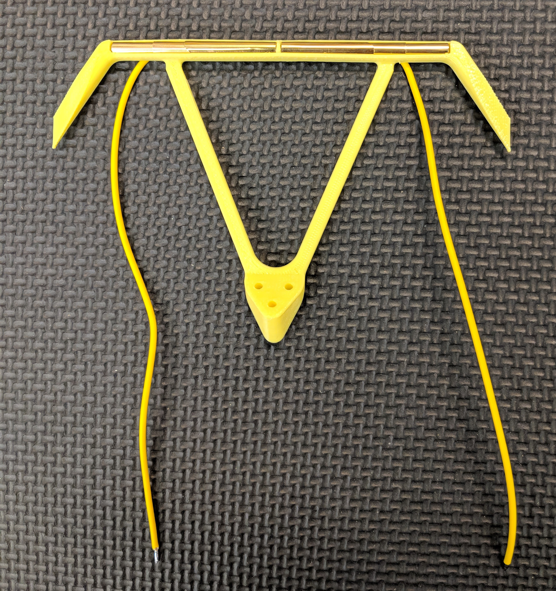
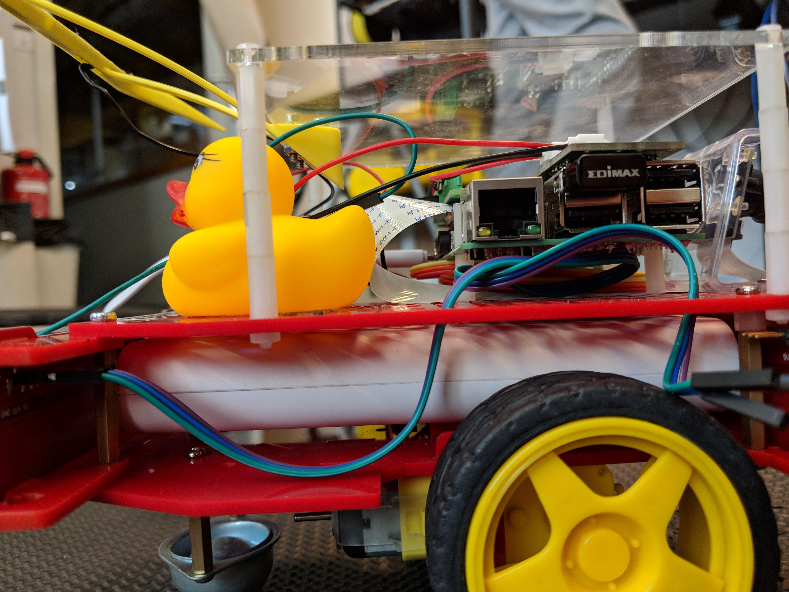

# Current collector {#autocharging-current-collector status=beta}

In order to let a Duckiebot charge in a charger, additional hardware is needed. This piece is called the current collector.

## Materials for a single current collector

* $6 \times$ [laboratory plug CAT I Ø4mm](https://www.distrelec.ch/en/p/14048007)
* $2 \times$ 1mm cable, length 30cm
* Robotarium add-on board
* If printer available: $5g$ Material for the 3D printer (cutest color is yellow)
* April tag plate
* $16 \times$ plastic spacers $M2.5 \times 12mm$ **or** $4 \times$ spacers $M2.5 \times 50mm$
* $7 \times$ screw $M2.5 \times 10mm$ and nut $M2.5$
* Soldering iron and solder

## Build a charging capable Duckiebot

### Cut / Order the april tag plate

If **a laser cutter is available**, then laser cut [this file](https://www.thingiverse.com/download:5140588) with the dimensions $110 \times 110mm$ (you probably need to scale it, depending on your programs units).

If **no laser cutter is available**, then order [this file](https://www.thingiverse.com/download:5140588) with the dimensions $110 \times 110mm$ from a page, for example [https://www.sculpteo.com/en/](https://www.sculpteo.com/en/).

### Print / Order the current collector

If **a 3D printer is available**, then [just follow these instructions](https://www.thingiverse.com/thing:2996297#instructions).

If **no 3D printer is available**, then order the printed part from [this site](https://www.shapeways.com/product/G5UASUBU4/megacity-current-collector-standard-version).

### Put together three laboratory plugs

Take three laboratory plugs and put them together as seen in .

<figcaption>
Three laboratory plugs put together.
</figcaption>

### Prepare the current collector soldering

Be sure to have everything ready in 

<figcaption>
Neccessary parts for the current collector soldering
</figcaption>

### Solder the wires

Solder the wires to the laboratory plugs as seen in .

<figcaption>
A wire soldered to the laboratory plugs.
</figcaption>

Put the cables through the 3D printed part as seen in .

<figcaption>
A current collector during the soldering process.
</figcaption>

### Optional: Glue the laboratory plugs

If for any reason the laboratory plugs do not fit tightly in the 3D printed part, glue them.

### Prepare the assembly

Make the parts ready as seen in .

<figcaption>
Neccessary parts for the assembly.
</figcaption>

### Assemble the april tag plate

Assemble the april tag plate by using the acrylic glass, screws and distance keepers as seen in 

<figcaption>
The assembled april tag plate
</figcaption>

### Mount current collector to april tag plate

Mount the current collector by using three screws and nuts as seen in 

<figcaption>
The current collector mounted to the april tag plate.
</figcaption>

### Plug in the robotarium add-on board

Plug in the robotarium add-on board as seen in 

<figcaption>
The robotarium add-on board.
</figcaption>

### Mount the structure to the Duckiebot

Mount the april tag board with the current collector assembled to a Duckiebot as in  and . Plug in the USB cable to the battery of the Duckiebot.

<figcaption>
The april tag plate mounted to a Duckiebot.
</figcaption>

<figcaption>
The resulting charging-capable Duckiebot.
</figcaption>

### Test your setup

Connect the brass pieces to a 5V voltage source and check if the battery signals that it is charging.
